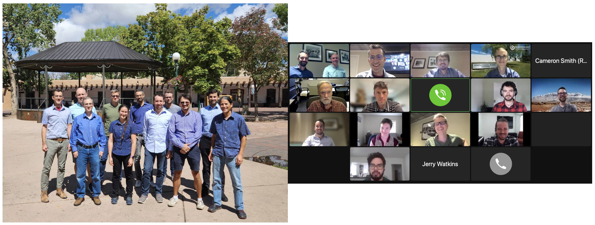

Flyer with more information on the MALI ice-sheet model can be found here:  [MALI](https://climatemodeling.science.energy.gov/sites/default/files/technical-highlights/TechnicalHighlight_MALI.pdf)

*ProSPect* ice sheet models will ultimately contribute to DOE's Energy Exascale Earth System Model (E3SM). More information can be found at the E3SM [homepage](https://e3sm.org/).

**Highlights**

* 12/2022: The FAnSSIE team was awarded computing time at the [National Energy Research Scientific Computing Center (NERSC)](https://www.nersc.gov/) for allocation year 2023 through the [Energy Research Computing Allocations Process](https://www.nersc.gov/users/accounts/allocations/request-form/).  The project received over 13,000 CPU node-hours and 6,000 GPU-node hours for development and simulation with MALI and E3SM.

* 9/2022: The FAnSSIE project kickoff meeting was held in a hybrid format in Santa Fe, NM, and virtually.  The project got off to a great start.

* Previous highlights related to MALI and many FAnSSIE project members can be found at the [ProSPect project highlights page](https://doe-prospect.github.io/highlights).
